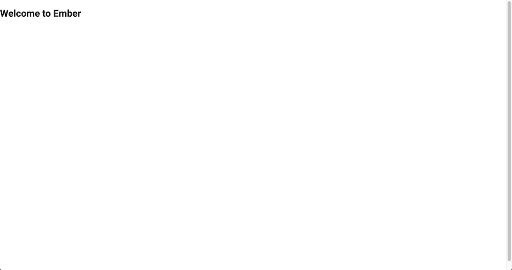
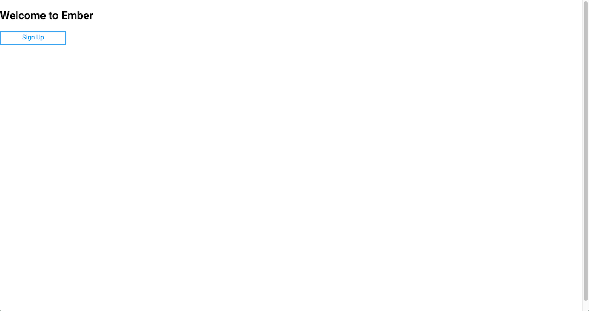
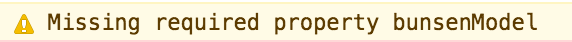
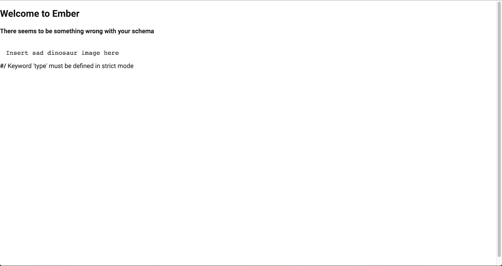
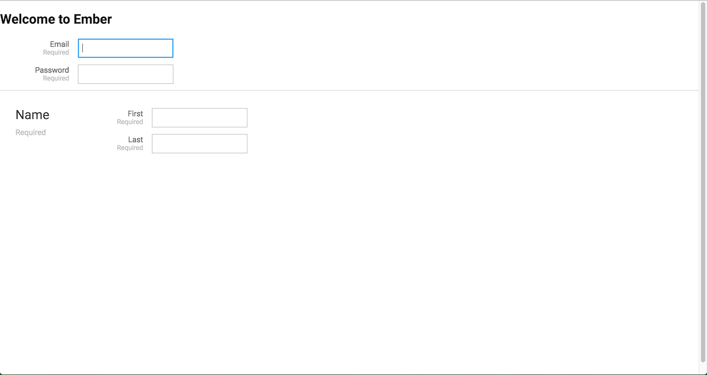
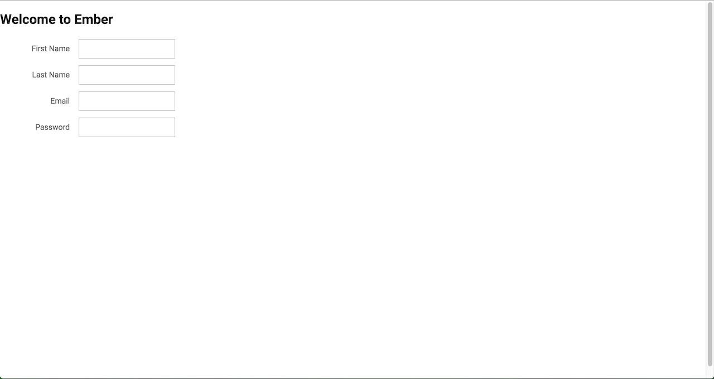
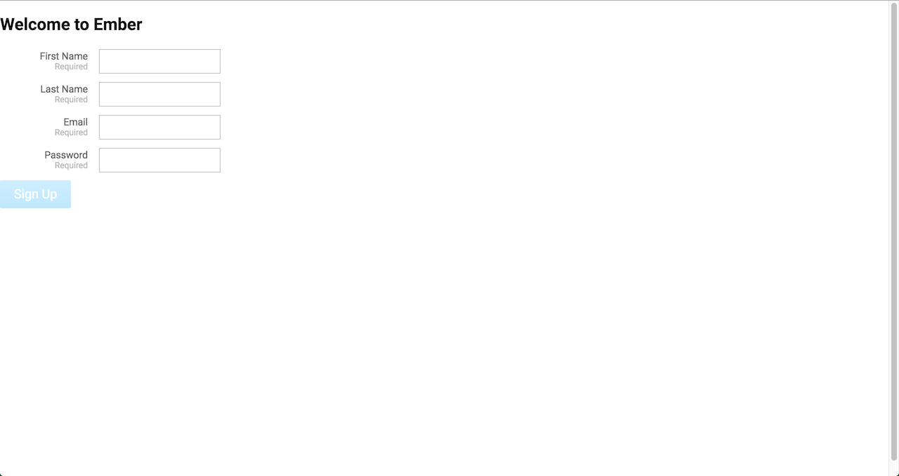
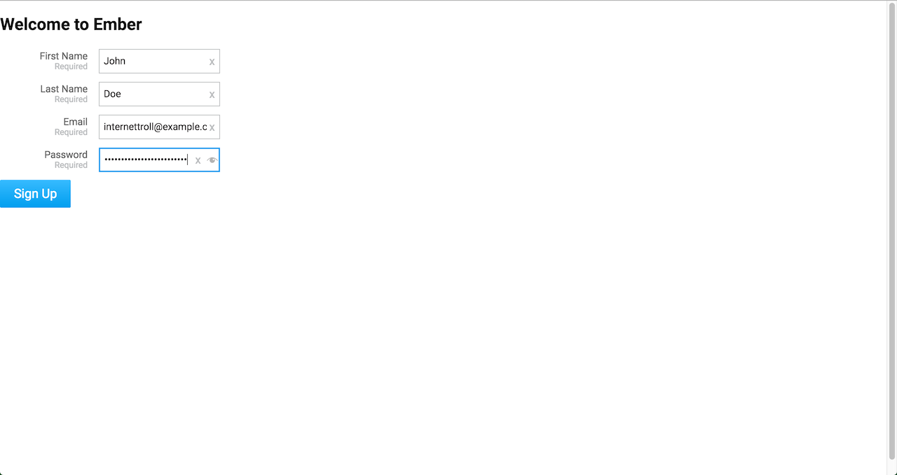
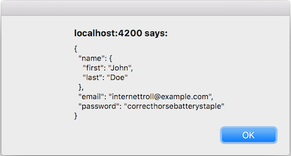
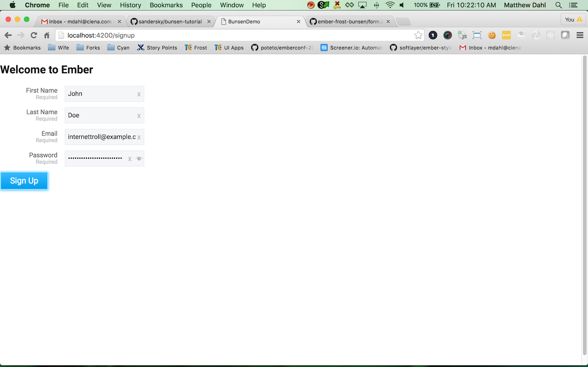

# Learn ember-frost-bunsen

## Getting Started

This tutorial will show you how to get started with `ember-frost-bunsen` by having you create a new application with a bunsen form for creating a new user account. You won't actually wire this form up to an API but will learn step-by-step how to go about creating this form in an intuitive process. Ideally after following this tutorial you will have the knowledge necessary to start using `ember-frost-bunsen` within your own application and generate the beautiful forms you desire.

### Initialize application

First lets create a new Ember application to get started:

```bash
ember new bunsen-demo && cd bunsen-demo
```

### Install `ember-frost-bunsen`

Now that we have an Ember application lets install `ember-frost-bunsen`:

```bash
ember install ember-frost-bunsen
```

Go ahead and run the application and verify it works:

```bash
ember serve
```

Verify your [local instance](http://localhost:4200) is running and you get the following:



### Setup Application

Now that we have initialized our project we can start by creating a new route for the sign up page:

```bash
ember g route signup
```

Now lets create a template for our index and add a link to the sign up page:

```bash
ember g template index
```

*app/templates/index.hbs*

```handlebars
{{#frost-link 'signup'
  priority='secondary'
  size='small'
}}
  Sign Up
{{/frost-link}}
```

Now your page should look like following:



### Create Sign Up Form

Now that we have our application and routes setup we can start digging into creating forms with bunsen.

We are going to need a controller for our signup route so lets create one:

```bash
ember g controller signup
```

Lets start by placing the `frost-bunsen-form` component on our sign up page. If you read the documentation for this component you will find that it has a required `bunsenModel` property so lets go ahead and initialize that with a property we will end up adding to our controller.

*app/templates/signup.hbs*

```handlebars
{{frost-bunsen-form
  bunsenModel=bunsenModel
}}
```

If you go ahead and try to visit the signup route in your browser you will find the following warning in your console:



#### Create Model

This is because `frost-bunsen-form` expects the model property to be either an Ember Object or a plain JavaScript Object and currently it is undefined since we haven't defined it in our controller. Lets go ahead and do that now:

*app/controllers/signup.js*

```js
import Ember from 'ember';

export default Ember.Controller.extend({
  bunsenModel: {}
});
```

Now if you run this in your browser you will see the following:



This error is because the model is expected to be valid JSON Schema. This tutorial is not going to go into what JSON Schema is but [here](http://spacetelescope.github.io/understanding-json-schema/) is a good place to go if you need to learn more about it.

Lets go ahead and update our model to be valid JSON schema for representing our signup form:

*app/controllers/signup.js*

```js
import Ember from 'ember';

export default Ember.Controller.extend({
  bunsenModel: {
    properties: {
      email: {
        format: 'email',
        type: 'string'
      },
      name: {
        properties: {
          first: {type: 'string'},
          last: {type: 'string'}
        },
        required: ['first', 'last'],
        type: 'object'
      },
      password: {
        type: 'string'
      }
    },
    required: ['email', 'name', 'password'],
    type: 'object'
  }
});
```

The above model shouldn't be too hard to comprehend as it is JSON Schema for an Object in the following format:

```json
{
  "email": "internettroll@example.com",
  "name": {
    "first": "John",
    "last": "Doe"
  },
  "password": "correcthorsebatterystaple"
}
```

Now you should see the following in your browser:



#### Create View

The above screenshot shows how easy it is to get a functioning form but it doesn't look as nice as we'd like. This is where bunsen views come into play.

Lets go ahead and update our signup template to pass a view into the `frost-bunsen-form` component:

*app/templates/signup.hbs*

```handlebars
{{frost-bunsen-form
  bunsenModel=bunsenModel
  bunsenView=bunsenView
}}
```

Next we need to define this view in our controller:

*app/controllers/signup.js*

```js
import Ember from 'ember';

export default Ember.Controller.extend({
  bunsenModel: …,
  bunsenView: {
    containers: [
      {
        id: 'main',
        rows: [
          [
            {
              label: 'First Name',
              model: 'name.first'
            }
          ],
          [
            {
              label: 'Last Name',
              model: 'name.last'
            }
          ],
          [
            {
              model: 'email'
            }
          ],
          [
            {
              model: 'password',
              properties: {
                type: 'password' // Render input as a password input instead of default text input
              }
            }
          ]
        ]
      }
    ],
    rootContainers: [
      {
        container: 'main',
        label: 'Main'
      }
    ],
    type: 'form',
    version: '1.0'
  }
});
```

In the above view JSON the `type` and `version` properties are always present and as of today always contain the values `form` and `1.0`. These properties exist so bunsen can be extended more in the future without breaking views from older versions. `rootContainers` informs bunsen which container(s) should be rendered on the form; if more than one is present it will render them as tabs with the `label` for each being used as the text on the tab. `containers` is an array of named containers where `id` is where the containers unique name is found. Each container must have a `rows` attribute which is an array of rows, with each row being an array of cells. These cells look similar to containers without the `id` attribute and inform bunsen what to render from the model. This is achieved via the `model` attribute which uses dot-notation of where the field lives within the model.

Now that we have defined a custom view you should see the following in your browser:



#### Creating Submit Button

Now that we have a decent looking form lets create a submit button that is only enabled when the form is valid. In order to achieve this we will leverage the `onValidation` property for the `frost-bunsen-form` component.

*app/templates/signup.hbs*

```handlebars
{{frost-bunsen-form
  bunsenModel=bunsenModel
  bunsenView=bunsenView
  onValidation=(action "formValidation")
}}
{{frost-button
  disabled=isFormInvalid
  priority="primary"
  size="medium"
  text="Sign Up"
}}
```

*app/controllers/signup.js*

```js
import Ember from 'ember';

export default Ember.Controller.extend({
  bunsenModel: …,
  bunsenView: …,
  isFormInvalid: true,

  actions: {
    formValidation (validation) {
      this.set('isFormInvalid', validation.errors.length !== 0);
    }
  }
});
```

Now you should see the following in your browser:



Once you fill out the form so that it becomes valid you will notice that the submit button becomes enabled:



Now that we have a submit button that becomes enabled when the form is valid we ideally want it to submit the form value to some backend API. We will go ahead and wire it up in this demo to simply present the form value in an alert. To get the form value we will leverage the `onChange` property of the `frost-bunsen-form`.

*app/templates/signup.hbs*

```handlebars
{{frost-bunsen-form
  bunsenModel=bunsenModel
  bunsenView=bunsenView
  onChange=(action "formChange")
  onValidation=(action "formValidation")
}}
{{frost-button
  disabled=isFormInvalid
  onClick=(action "submitForm")
  priority="primary"
  size="medium"
  text="Sign Up"
}}
```

*app/controllers/signup.js*

```js
import Ember from 'ember';

export default Ember.Controller.extend({
  bunsenModel: …,
  bunsenValue: null,
  bunsenView: …,
  isFormInvalid: true,

  actions: {
    formChange (value) {
      this.set('bunsenValue', value);
    },
    formValidation (validation) {
      this.set('isFormInvalid', validation.errors.length !== 0);
    },
    submitForm () {
      const value = this.get('bunsenValue');
      alert(JSON.stringify(value, null, 2));
    }
  }
});
```

Now you should see the following alert when you fill out the form and press the submit button:



#### Disable During Submission

In the event you have the form wired up to a real backend you may want to disable the form while you are waiting for the API request to complete. For this demo lets make the submission wait a couple seconds before presenting the alert and during that time disable the entire form in an effort to simulate a slow API request. We will leverage the `disabled` property of the `frost-bunsen-form` component to disable the form.

*app/templates/signup.hbs*

```handlebars
{{frost-bunsen-form
  bunsenModel=bunsenModel
  bunsenView=bunsenView
  disabled=isFormDisabled
  onChange=(action "formChange")
  onValidation=(action "formValidation")
}}
{{frost-button
  disabled=(or isFormDisabled isFormInvalid)
  onClick=(action "submitForm")
  priority="primary"
  size="medium"
  text="Sign Up"
}}
```

*app/controllers/signup.js*

```js
import Ember from 'ember';

export default Ember.Controller.extend({
  bunsenModel: …,
  bunsenValue: null,
  bunsenView: …,
  isFormDisabled: false,
  isFormInvalid: true,

  actions: {
    formChange (value) {
      this.set('bunsenValue', value);
    },
    formValidation (validation) {
      this.set('isFormInvalid', validation.errors.length !== 0);
    },
    submitForm () {
      this.set('isFormDisabled', true);

      Ember.run.later(() => {
        const value = this.get('bunsenValue');
        alert(JSON.stringify(value, null, 2));
        this.set('isFormDisabled', false);
      }, 3000);
    }
  }
});
```

Now when you submit the form you should see the following for 3 seconds before getting the alert:



*Rest of tutorial coming soon…*
